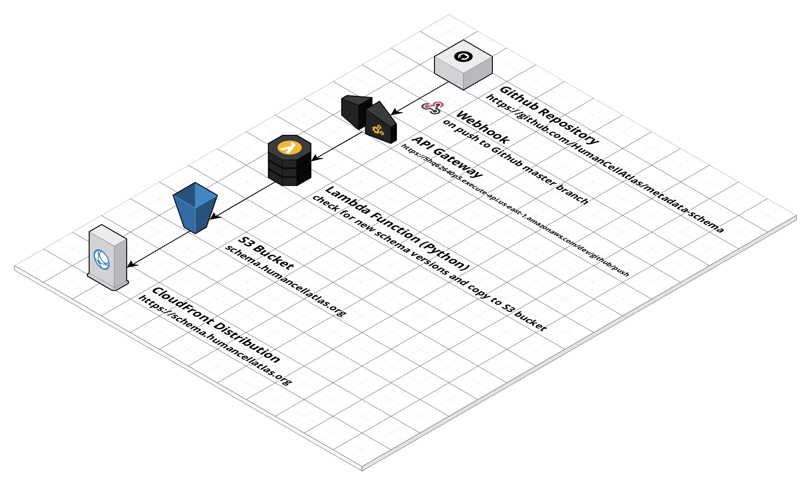

# Metadata Schema Publisher

Automatically publishes metadata schemas to [schema.humacellatlas.org](http://schema.humancellatlas.org) when changes are made to the [GitHub repo](https://github.com/HumanCellAtlas/metadata-schema).

## Architecture


## Setup

### Install NodeJS dependencies
Run:
```
npm install
```
To install required node libraries. Even though the Lambdas are written in Python the framework is in NodeJS and it needs extra plugins.

### Install Python dependencies
Run:
```
pip install -r requirements.txt
```

## Run Locally

[Run a function locally](https://serverless.com/framework/docs/providers/aws/cli-reference/invoke-local/#)

Run with a simulated GitHub event:

```
serverless invoke local --function onGithubPush --path ./tests/files/raw-push-event.json
```

## Invoke on AWS
```
serverless invoke --function onGithubPush --path ./tests/files/github-event-push.json

```
## Deploy
```
serverless deploy -v
```

###Logic

- On GitHub [push](https://developer.github.com/v3/activity/events/types/#pushevent) event
- Go through all files ending with .json in the json_schema folder in the rep
- Check the id field in each schema and use that as the key of S3
- Check if the S3 key exists and if not upload the file
- Send notifications for when the process starts and a summary when it finishes


## TODO
- ~~Update README.md~~
- ~~Remove JavaScript~~
- ~~Rename project to something starting metadata~~
- ~~Change region of deployment~~
- ~~Change to actual Github repo~~
- ~~Chnage to schema.humancellatlas.org bucket~~
- ~~Change to responding to commits instead of releases~~
- ~~Add Slack notifications to a HCA slack channel~~
  ~~- For triggered~~
  ~~- For results~~
- ~~Check index.html works when shifts to schema.humacellatlas.org~~
- Consider adding CloudFront (with 5 min cache)
- Encrypt API key and Slack URL
- Add and check secret from webhook
- ~~Add user that performed the push to notification~~
- ~~See if we need to specifiy the mime type~~
- Consider how to return 200 to webhook quickly to stop it showing failed

    
